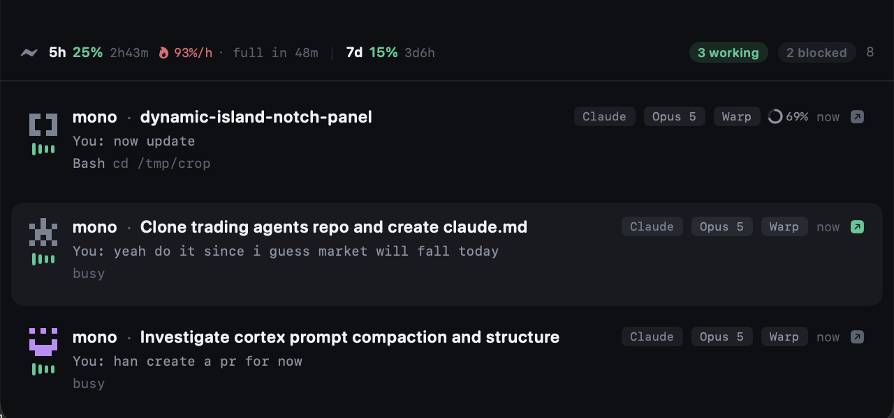

<div align="center">

# 🏝️ Agent Island

**Your MacBook notch, turned into mission control for Claude Code.**

See every agent at a glance · jump to the exact terminal tab · approve and answer without leaving the notch

[](https://www.apple.com/macos/)
[](https://swift.org)
[](https://www.swift.org/getting-started/)
[](tests/selftest.py)
[](#-licence)

</div>

---

> [!NOTE]
> Everything runs locally. No server, no telemetry, no API key, no subscription.
> Agent Island reads only what Claude Code already writes to your own disk.

<div align="center">
  
  <br>
  <sub>Quota and burn rate up top · one row per agent with its model, terminal, context ring, last instruction and live tool call</sub>
</div>

## 🤔 Why

Running five to ten Claude Code sessions at once, the bottleneck stops being the agents — it becomes **you**.

Which one is blocked? Which is quietly burning the 5-hour window? Which of nine identical terminal tabs did that notification come from? Claude Code knows all of it. It just never shows you.

Agent Island puts the answer where your eyes already are.

## ✨ Features

### 👀 See
| | |
|---|---|
| 📋 **Live sessions** | Title, project, model, terminal and the tool call happening right now |
| 🎯 **Task progress** | `4/9` with the current step, from Claude's own task list |
| 🧠 **Context pressure** | A per-session ring — compact *before* the cliff, not after |
| ⚡ **Quota** | 5h and 7d windows, a measured burn rate, and projected exhaustion |
| 💀 **Died vs finished** | A rate-limited session shows as dead, not complete |
| 🧊 **Blocked, not shouting** | Agents stuck on an old question stay visible without crying wolf |

### 🚀 Act
| | |
|---|---|
| 🎬 **Precise jump** | Click a row → land on that agent's **exact Warp tab**, not just the app |
| ✅ **Approve from the notch** | Permission cards, answered with `⌘⌥A` / `⌘⌥D` |
| 💬 **One-click answers** | Multiple-choice prompts answered with `⌘⌥1`–`⌘⌥4` |
| 🤖 **Auto-approve rules** | A regex allowlist, so routine commands never interrupt you |
| 🔔 **Alerts that respect you** | Desktop notifications only when you're *not* already looking |

## 🧭 The Warp jump

The interesting part. 👇

Other notch apps resolve Warp tabs by reading `warp.sqlite` and driving a **keystroke loop**, because the `warp://action/*` scheme is a closed whitelist that rejects focus intents. That approach can't tell apart tabs that share a working directory — so if all your agents live in one monorepo, it lands on the wrong one.

But Warp exports a per-session handle into every shell it spawns:

```bash
WARP_TERMINAL_SESSION_UUID=936130df75f04ef3937afb799bdb1946
WARP_FOCUS_URL=warp://session/936130df75f04ef3937afb799bdb1946
```

Opening that URL makes Warp fire a `handle_pane_navigation_event` and focus the tab. So the whole jump is:

```
claude agents --json  →  pid  →  WARP_FOCUS_URL from that process's env  →  open
```

🗄️ No database. ⌨️ No synthetic keystrokes. 🔓 No Accessibility permission. And it resolves correctly **even when every tab shares one repo** — measured at 6/6 distinct tabs.

## 📦 Install

```bash
git clone https://github.com/Tiwari1999/Agent-Island.git
cd Agent-Island
./install.sh
```

`install.sh` builds a release binary, assembles `~/Applications/AgentIsland.app`, registers the hooks, and launches it.

<details>
<summary>🔧 Build only, without installing</summary>

```bash
swift build -c release
```

Xcode is **not** required — Command Line Tools are enough.
</details>

### Requirements

- 🍎 macOS 14+
- 🤖 Claude Code (`claude` on your `PATH`)
- 🖥️ Warp — for the precise-jump feature (everything else works without it)

## 🪝 Hooks

Agent Island listens to Claude Code's hook events:

| Hook | Powers |
|---|---|
| `PreToolUse` / `PostToolUse` | live activity per session |
| `Notification` | an agent genuinely needs you |
| `Stop` / `SessionEnd` | completion toast |
| `StopFailure` | died-vs-finished, with `error_type` |
| `PermissionRequest` | approval cards + auto-approve rules |
| `PreToolUse` (`AskUserQuestion`) | one-click answers |
| `statusLine` | quota, model, per-session context window |

> [!IMPORTANT]
> **Every hook fails open.** If the app isn't running, or you don't answer in time, or a rules file is malformed, the hook exits silently and Claude prompts you normally.
> A hook that hangs would freeze your session — so none of them can.

The `statusLine` wrapper runs your **existing** statusline unchanged inside it, and hook registration never clobbers another tool's entries. 🤝

## 🤖 Auto-approve rules

`~/.agentisland/rules.json` — consulted *before* you're ever asked:

```json
[
  {"tool": "Bash", "pattern": "^git (status|diff|log|show)\\b", "action": "allow"},
  {"tool": "Bash", "pattern": "^npm test$", "cwd": "/Users/me/project", "action": "allow"},
  {"tool": "Read", "pattern": ".", "action": "allow"}
]
```

`tool` and `cwd` are optional; `pattern` is a regex over the command or file path. Anything that doesn't match falls through and still asks. ✋

## 🏗️ Architecture

```
Claude Code ──hooks──────────> /tmp/agentisland-events.jsonl ──tail──> HookStream
            ──statusLine─────> /tmp/agentisland-status/<id>.json ─────> StatusStore
            ──agents --json──────────────────────────────────────────> AgentStore
                                                                            │
                                       approvals / answers <──decision file─┘
```

Two design rules earned the hard way:

- 🪟 **The window is created once at maximum size and never resized.** The window server can't interpolate content across a live resize, so every bit of motion happens inside SwiftUI.
- 🖱️ **Hover uses an `NSTrackingArea`, never polling.** A 32pt strip is crossed in under 40 ms — faster than any practical poll interval, so polling misses it more often than it catches it.

## 🧪 Tests

```bash
python3 tests/selftest.py
```

65 checks: jump resolution against live Warp tabs, every hook contract (including that each failure path exits without blocking), auto-approve decisions, panel geometry, and the staleness window.

## 📄 Licence

MIT

<div align="center">
<sub>Built for people running more agents than they have eyes. 👀</sub>
</div>
