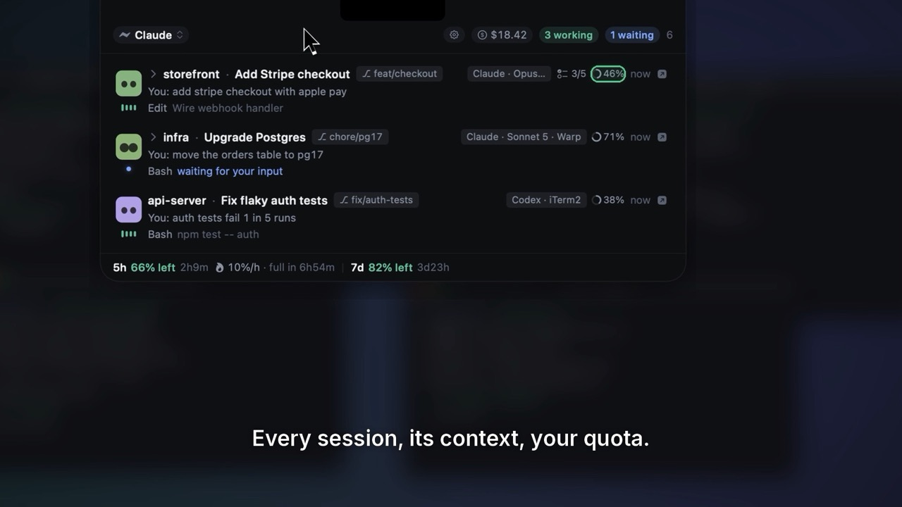
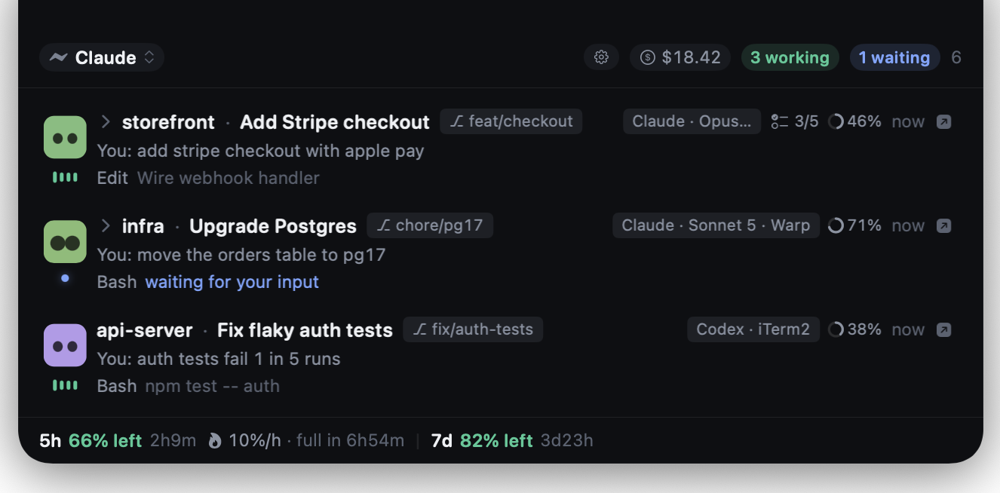
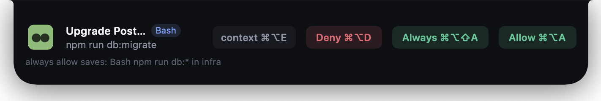
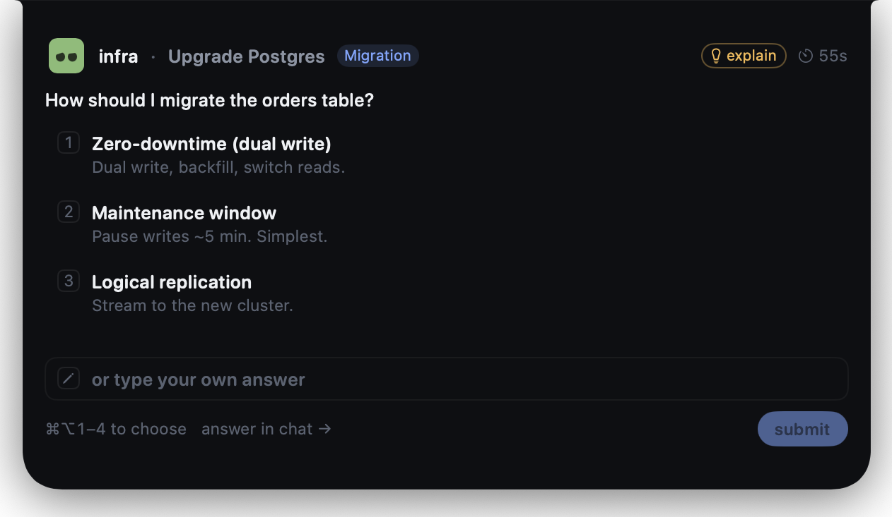
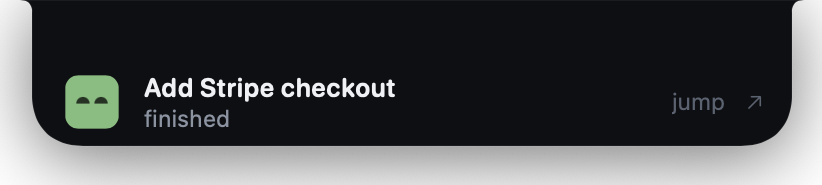
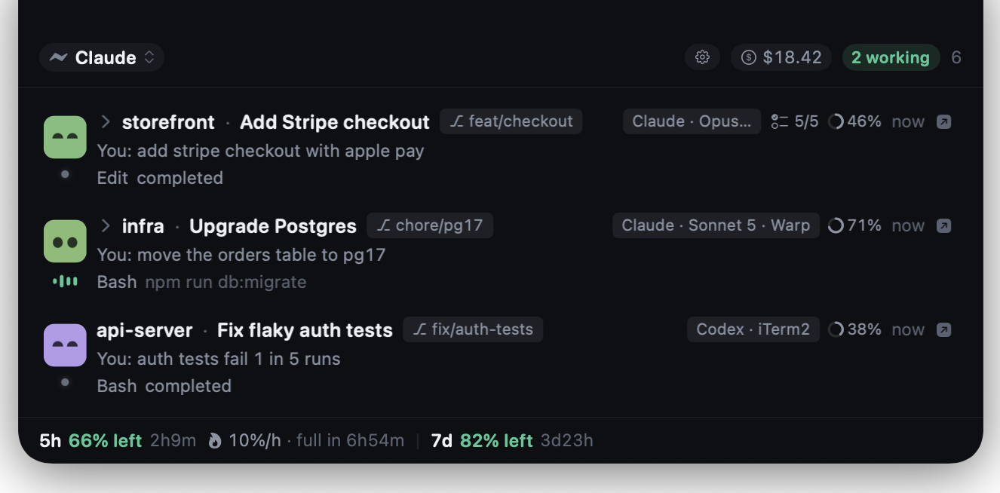

<div align="center">

# 🏝️ Agent Island

**Your MacBook notch, turned into mission control for every coding agent you run.**

Claude Code · Codex · Cursor · Gemini CLI · OpenCode — one panel, at a glance · jump to the exact terminal tab · approve and answer without leaving the notch

[](https://www.apple.com/macos/)
[](https://swift.org)
[](https://www.swift.org/getting-started/)
[](tests/selftest.py)
[](#-licence)

</div>

---

> [!NOTE]
> Everything runs locally. No server, no telemetry, no API key, no subscription.
> Agent Island reads only what your agents already write to your own disk.

<div align="center">
  <a href="https://github.com/Tiwari1999/Agent-Island/releases/download/v0.5.0/agent-island-demo.mp4"></a>
  <br>
  <sub>▶ <a href="https://github.com/Tiwari1999/Agent-Island/releases/download/v0.5.0/agent-island-demo.mp4"><b>Watch the 40-second demo</b></a></sub>
</div>

<div align="center">
  
  <br>
  <sub>Every agent in one list: branch, context ring, today's spend, and how much of the 5h and 7-day windows is left</sub>
</div>

<table>
  <tr>
    <td width="50%"><br><sub><b>Approve from the notch</b>: Deny, Allow, or Always allow a narrow rule</sub></td>
    <td width="50%"><br><sub><b>Answer questions</b>: pick an option or type your own</sub></td>
  </tr>
  <tr>
    <td><br><br><sub><b>Finished, and what is running</b>: a toast with <b>jump</b> to the exact tab, and the bar at rest</sub></td>
    <td><br><sub><b>Done vs working</b> at a glance</sub></td>
  </tr>
</table>

## 🤔 Why

Running five to ten coding agents at once — Claude Code in one Warp tab, Codex in another, a Cursor
chat on a third project — the bottleneck stops being the agents. It becomes **you**.

Which one is blocked? Which is quietly burning the 5-hour window? Which of nine identical terminal tabs did that notification come from? Each agent knows its own answer, and none of them shows you.

Agent Island puts the answer where your eyes already are.

## ✨ Features

### 👀 See
| | |
|---|---|
| 🧩 **Every agent** | Claude Code, Codex, Cursor, Gemini CLI and OpenCode in one list, each labelled with its own vendor |
| 📋 **Live sessions** | Title, project, model, terminal and the tool call happening right now |
| 🎯 **Task progress** | `4/9` with the current step, from Claude's own task list |
| 🧠 **Context pressure** | A per-session ring — compact *before* the cliff, not after |
| ⚡ **Quota** | Limit windows for Claude (5h/7d) and Codex (5h/weekly); the measured burn rate and projected exhaustion need Claude's status line |
| 💀 **Died vs finished** | A rate-limited session shows as dead, not complete |
| 🧊 **Blocked, not shouting** | Agents stuck on an old question stay visible without crying wolf |

### 🚀 Act
| | |
|---|---|
| 🎬 **Precise jump** | Click a row → land on that agent's **exact tab** — Warp, iTerm2, Terminal.app, kitty or WezTerm — not just the app |
| 💠 **Cost breakdown** | API-equivalent spend per model, today and this month — from the vendors' own token accounting |
| 📋 **Plan review** | Read the full Markdown plan and approve it from the notch, with a 55s window instead of 20 |
| 📊 **Pick your agent** | One control in the header switches which agent it reports on — that agent's own limit windows and its own spend, defaulting to whichever you use most |
| 📊 **Per-vendor limits** | Claude's 5h/7d windows and Codex's own rate limits, one vendor at a time; at rest the bar shows whichever limit is closest to biting instead of just "idle" |
| 💚 **Proof of life** | The resting bar shows *what* the agent is doing, not just that it is running — the motion differs for thinking, reading, editing, running and waiting. CoreAnimation-backed, 0.15% CPU |
| 🕊 **Zero spawns at idle** | A refresh creates no processes at all — the process table, environments and working directories are read with syscalls; warm discovery of 27 sessions takes 0.08s |
| 🛰 **SSH remote monitoring** | Sessions on machines you ssh into, in the same panel — `echo my-vm >> ~/.config/agentisland/remotes`; the probe travels on stdin, nothing is installed remotely |
| ✅ **Approve from the notch** | Permission cards, answered with `⌘⌥A` / `⌘⌥D` |
| 💬 **Answer questions** | `AskUserQuestion` prompts answered in the notch: multiple choice with `⌘⌥1`–`⌘⌥4`, a **free-text** field for your own answer, and multi-question asks sequenced with clickable pips (`⌘⌥⇧1`–`⌘⌥⇧4` to jump). Nothing sends until you press **submit** |
| ⏳ **Sliding window** | A visible countdown before an unanswered question hands back to the terminal; every interaction pushes it forward, so answering never times out under you |
| 💬 **Or answer in the chat** | One click releases the turn so Claude's own picker appears in the terminal, and the notch keeps a read-only copy — the question stays visible in both places |
| 🤖 **Auto-approve rules** | A regex allowlist for Claude Code permission requests. The rule vocabulary is vendor-neutral — one rule is written to cover Claude's `Bash` and Cursor's `Shell` alike — but only Claude Code publishes a permission hook today, so that is the only agent it governs |
| 🔔 **Alerts that respect you** | Desktop notifications only when you're *not* already looking |

## 🧭 The precise jump

The interesting part. 👇 (Warp is the neat case; iTerm2, Terminal.app, kitty, WezTerm, tmux, VS Code, Cursor and Ghostty work too: see the table below.)

Other notch apps resolve Warp tabs by reading `warp.sqlite` and driving a **keystroke loop**, because the `warp://action/*` scheme is a closed whitelist that rejects focus intents. That approach can't tell apart tabs that share a working directory — so if all your agents live in one monorepo, it lands on the wrong one. Agent Island reads nothing from Warp's database: the session handle comes from the agent process's own environment, so there is no permission to grant and nothing to break when the schema changes.

But Warp exports a per-session handle into every shell it spawns:

```bash
WARP_TERMINAL_SESSION_UUID=936130df75f04ef3937afb799bdb1946
WARP_FOCUS_URL=warp://session/936130df75f04ef3937afb799bdb1946
```

Opening that URL makes Warp fire a `handle_pane_navigation_event` and focus the tab. So the whole jump is:

```
claude agents --json  →  pid  →  WARP_FOCUS_URL from that process's env  →  open
```

🗄️ No database. ⌨️ No synthetic keystrokes. 🔓 No Accessibility permission. And it resolves correctly **even when every tab shares one repo** — measured at 6/6 distinct tabs.

The same idea generalises: the handle for *every* terminal comes from the agent process's own environment, and each is focused by that terminal's real API — no keystroke loops anywhere.

| Terminal | Handle (from the process env) | How it's focused | Permission |
|---|---|---|---|
| Warp | `WARP_FOCUS_URL` | open the `warp://session/…` URL | none |
| iTerm2 | `ITERM_SESSION_ID` (`wNtNpN:UUID`) | AppleScript `select` the session whose id is that UUID | Automation, asked once |
| Terminal.app | the process's controlling **tty** (read by syscall) | AppleScript select the tab whose `tty` matches | Automation, asked once |
| kitty | `KITTY_WINDOW_ID` | `kitty @ focus-window --match id:N` | none — but kitty needs `allow_remote_control yes` in `kitty.conf` |
| WezTerm | `WEZTERM_PANE` | `wezterm cli activate-pane --pane-id N` | none, if the `wezterm` CLI is on `PATH` |
| VS Code / Cursor | the agent's shell **pid** (VS Code exposes no tab id in the env) | a bundled extension's URI handler shows the terminal whose `processId` matches | the editor asks once to let the extension open the URI |
| Ghostty | the controlling **tty** | AppleScript `focus` on the terminal whose `tty` matches, only on builds that expose `tty` (newer than 1.3) | Automation, asked once |

The two subtle bugs worth calling out, because they read as "the jump is broken": iTerm2's env handle carries a `wNtNpN:` pane prefix its scripting id does **not**, so a whole-string match never hit — the fix matches on the UUID. And Terminal.app's `TERM_SESSION_ID` is a UUID it never surfaces in AppleScript, so the only usable handle is the controlling tty, read from the process by syscall. Both are covered by `tests/terminals-e2e.py`, which opens two real sessions per terminal and proves the jump lands on the intended one, not its neighbour.

kitty and WezTerm resolve by the same rule, and their handles are checked in the suite — but unlike the three above they have not been round-tripped against real windows here. If one of them only raises the app, its control CLI is the first thing to check: `kitty @ ls` and `wezterm cli list` have to work from your shell.

## 💬 Answering from the notch

When Claude asks an `AskUserQuestion` — the multiple-choice prompts, including the ones with a
preview panel and the multi-question asks — the card comes to the notch and you answer it there:
`⌘⌥1`–`⌘⌥4`, a free-text field for your own answer, pips to move between questions, **submit** to
send. Nothing is sent until you press it.

The honest part: the terminal and the notch **cannot both be live at once**. A Claude Code hook
runs *before* the picker is drawn, so while the notch holds the answer the terminal shows nothing —
and once the hook lets go, the terminal owns the picker and the notch can't reach into it. So the
notch takes first crack with a **sliding window**: a visible countdown, pushed forward by every
interaction, that hands the turn back to the terminal if you go idle. Want the terminal instead?
**answer in chat →** releases it immediately and keeps the card up as a read-only copy, so the
question is visible in both places. 🪟 One place is interactive at a time — by design, not by
accident.

## 📦 Install

macOS 14+, Apple silicon or Intel. **No Xcode**: Apple's Command Line Tools are enough
(`xcode-select --install`).

**Homebrew** (recommended):

```bash
brew install tiwari1999/tap/agent-island
agent-island      # copies the app to ~/Applications, adds the hooks, starts it
```

It builds on your Mac in about a minute, so there is no Gatekeeper warning and no notarization
involved. Update with `brew upgrade agent-island && agent-island`.

**From source:**

```bash
git clone https://github.com/Tiwari1999/Agent-Island.git
cd Agent-Island
./install.sh
```

`install.sh` builds the app into `~/Applications/AgentIsland.app`, registers hooks for every agent
it finds, and launches it. Run it again after `git pull` to update; it only changes what is out of
date.

**Full guide:** [`docs/INSTALL.md`](docs/INSTALL.md) covers first-launch permissions, what changes
for each agent, exact-tab jumps in VS Code, Cursor and Ghostty, updating, uninstalling and
troubleshooting.

<details>
<summary>🧹 What it touches, and how to undo it</summary>

It appends hook entries to `~/.claude/settings.json` and, where present, `~/.codex/hooks.json`,
`~/.cursor/hooks.json` and `~/.gemini/settings.json`; drops one plugin file into
`~/.config/opencode/plugins/`; and installs a small terminal-focus extension into VS Code and
Cursor. It takes a timestamped backup of each file first and never rewrites or reorders other
tools' entries. An existing `statusLine` is saved and run inside ours rather than replaced.

```bash
python3 scripts/uninstall-hooks.py     # removes only our entries, restores your statusLine
rm -rf ~/Applications/AgentIsland.app
```
</details>

### Requirements

- 🍎 macOS 14+
- 🤖 At least one of Claude Code, Codex, Cursor, Gemini CLI or OpenCode — whichever are installed are picked up automatically
- 🖥️ For the **precise jump**: Warp, iTerm2, Terminal.app, kitty, WezTerm, tmux, or a VS Code / Cursor terminal (Ghostty on builds newer than 1.3). Anywhere else the jump brings the app forward, and the row says why

### What each agent supports

Measured, not assumed. A capability an agent does not expose is labelled on the row rather than
left blank, so an unsupported feature never reads as a broken one.

| | Claude Code | Codex | Cursor | Gemini CLI | OpenCode |
|---|---|---|---|---|---|
| Session list | ✅ | ✅ | ✅ | ✅ | ✅ |
| Live tool activity | ✅ | ✅ | ✅ | ✅ | ✅ |
| Approve from the notch | ✅ | — | — | — | ✅ |
| Answer questions from the notch | ✅ | — | — | — | — |
| Context pressure | ✅ | ✅ | — | ✅ | — |
| Limit windows | ✅ | ✅ | — | — | — |
| Burn rate and projection | ✅ | — | — | — | — |
| Task progress | ✅ | — | — | — | — |
| Precise jump | ✅ | ✅ | ✅ | ✅ | ✅ |
| Resume when stopped | ✅ | ✅ | ✅ | ✅ | ✅ |

Approvals and questions need an agent that asks permission through a hook before it acts, and
accepts an answer back. Claude Code publishes one (`PermissionRequest`, `AskUserQuestion`).
OpenCode has no such hook (`permission.ask` is declared but never called), but its plugin sees
`permission.asked` and can reply through OpenCode's own server, so its asks get a card too —
not filtered by the auto-approve rules, and its terminal prompt stays up in parallel. Gemini
CLI's `BeforeTool` hook can deny but never grant, and Codex and Cursor expose nothing to answer,
so those rows are dashes rather than promises. A Gemini permission prompt still marks its row
as waiting on you (its `Notification` hook). Gemini and OpenCode keep no limits on disk.

## 🪝 Hooks

Agent Island listens to each agent's hook events. Claude Code and Codex share a `hooks.json`
schema; Cursor uses its own event names, which are folded onto one vocabulary internally so a
`Bash` rule also governs a `Shell` call. Gemini CLI takes the same shape in
`~/.gemini/settings.json` under its own names (`BeforeTool`, `AfterAgent`, …). OpenCode has no
hooks file: the installer drops `agentisland-opencode.js` into `~/.config/opencode/plugins/`.

| Hook | Powers |
|---|---|
| `PreToolUse` / `PostToolUse` | live activity per session |
| `Notification` | an agent genuinely needs you |
| `Stop` / `SessionEnd` | completion toast |
| `StopFailure` | died-vs-finished, with `error_type` |
| `PermissionRequest` | approval cards + auto-approve rules |
| `PreToolUse` (`AskUserQuestion`) | answer questions from the notch — choice, free text, sliding window |
| `statusLine` | quota, model, per-session context window |

> [!IMPORTANT]
> **Every hook fails open.** If the app isn't running, or you don't answer in time, or a rules file is malformed, the hook exits silently and Claude prompts you normally.
> A hook that hangs would freeze your session — so none of them can.

The `statusLine` wrapper runs your **existing** statusline unchanged inside it, and hook registration never clobbers another tool's entries. 🤝

## 🤖 Auto-approve rules

`~/.agentisland/rules.json` — consulted *before* you're ever asked:

```json
[
  {"tool": "Bash", "pattern": "^git (status|diff|log|show)\\b", "action": "allow"},
  {"tool": "Bash", "pattern": "^npm test$", "cwd": "/Users/me/project", "action": "allow"},
  {"tool": "Read", "pattern": ".", "action": "allow"}
]
```

`tool` and `cwd` are optional; `pattern` is a regex over the command or file path. Anything that doesn't match falls through and still asks. ✋

**Always allow** (⌘⌥⇧A) on an approval card allows the request and appends a rule here, shown on the card before you press it. It is narrow by construction: a Bash rule names the program and subcommand (`^git status` plus plain arguments only, no `;` `|` `>` `$` or backticks) in that project; an edit rule covers files beside the edited one, never under a hidden directory. Destructive commands, interpreters and anything with shell metacharacters get no such button. Delete an entry from the file to take a rule back.

## 🏗️ Architecture

```
Claude Code ─hooks──┐
Codex       ─hooks──┤
Cursor      ─hooks──┼───> /tmp/agentisland-events.jsonl ──tail──> HookStream
Gemini CLI  ─hooks──┤
OpenCode    ─plugin─┘

Claude Code ──statusLine──> /tmp/agentisland-status/<id>.json ───> StatusStore
Claude ──agents --json──┐
Codex  ──rollout files──┼──────────────────────────────────────> AgentStore
Cursor ──chats/meta.json┤
Gemini ──tmp/*/chats────┤
OpenCode ──opencode.db──┘
                                                                            │
                                       approvals / answers <──decision file─┘
```

Two design rules earned the hard way:

- 🪟 **The window is created once at maximum size and never resized.** The window server can't interpolate content across a live resize, so every bit of motion happens inside SwiftUI.
- 🖱️ **Hover is an 80 ms poll of the pointer, not a window.** A tracking-area window over the notch swallowed clicks meant for the menu bar and fullscreen tab strips, and a global event monitor never saw the crossings. Missing a fast pass-through is the point: that is someone on their way to the menu bar.

## 🧪 Tests

```bash
python3 tests/selftest.py
```

980+ checks: jump resolution against live Warp tabs, the per-terminal jump handles (iTerm2's UUID-after-prefix and Terminal.app's tty, with a full round-trip in `tests/terminals-e2e.py`), every hook contract (including that each failure path exits without blocking), the full question flow (free-text answers crossing the same validation as labels, state surviving a close/reopen, the sliding grace, no answer sent until submit), auto-approve decisions, panel geometry, the staleness window, and that the panel holds only real sessions — every vendor present on disk reaches it, no row is labelled with a bare session id, and no test data survives.

## 📄 Licence

MIT, see [`LICENSE`](LICENSE).

<div align="center">
<sub>Built for people running more agents than they have eyes. 👀</sub>
</div>
